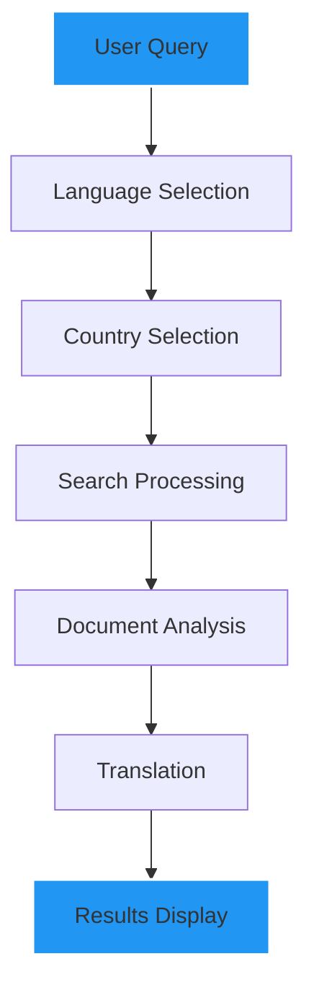

<div align="center">

# 🏛️ GovEase


[](https://www.python.org/downloads/)
[](https://streamlit.io/)
[](https://groq.com/)
[](https://www.crummy.com/software/BeautifulSoup/)
[](LICENSE)

<p align="center">

</p>

Navigate government procedures with ease using AI-powered document search and comprehensive guidance.

</div>

## ✨ Features

<div align="center">

</div>

- 🌐 **Multi-Language Support**
  - English, Hindi, Spanish, French, German, Urdu
  - Real-time translation capabilities
  
- 🔍 **Intelligent Search**
  - Advanced web crawling
  - PDF document processing
  - Concurrent document analysis
  
- 🎯 **User-Friendly Interface**
  - Clean, modern design
  - Dark mode support
  - Progress tracking
  - Responsive layout

- 🚀 **Smart Processing**
  - Asynchronous operations
  - Concurrent document processing
  - Timeout handling
  - Robust error management

<div align="center">

</div>

## 🚀 Quick Start

```bash
# Clone the repository
git clone https://github.com/yourusername/govease.git

# Navigate to project directory
cd govease

# Install dependencies
pip install -r requirements.txt

# Set up environment variables
cp .env.example .env

# Run the application
streamlit run main.py
```

## 🛠️ Environment Setup

```env
GROQ_API_KEY=your_groq_api_key
SERPER_API_KEY=your_serper_api_key
BROWSERLESS_API_KEY=your_browserless_api_key
```

## 🏗️ Architecture



## 💻 Tech Stack

<div align="center">

</div>

- **Frontend**: 
  - Streamlit
  - Custom CSS
  - Responsive Design

- **Backend**:
  - Python 3.9+
  - Asyncio
  - Concurrent.futures

- **AI & Processing**:
  - Groq AI
  - BeautifulSoup4
  - PyPDF2
  - Langdetect

- **APIs**:
  - Serper API
  - Browserless API

## 📱 Interface

<div align="center">
<table>
<tr>
<td width="50%">
<p align="center">
<strong>Home Page</strong><br>
• Welcome Screen<br>
• Language Selection<br>
• Quick Start Guide
</p>
</td>
<td width="50%">
<p align="center">
<strong>Search Interface</strong><br>
• Query Input<br>
• Progress Tracking<br>
• Results Display
</p>
</td>
</tr>
</table>
</div>

## 🌟 Key Features Explained

<div align="center">

</div>

### 🔄 Concurrent Processing
```python
with concurrent.futures.ThreadPoolExecutor(max_workers=3) as executor:
    future_to_url = {
        executor.submit(
            self.search_tool.process_url_with_timeout, 
            result.get('link', '')
        ): result.get('link', '')
        for result in search_results[:total_urls]
    }
```

### 🎨 Custom Styling
```python
gradient_css = """
    .stApp {
        background: linear-gradient(135deg, #1e3c72 0%, #2a5298 100%);
    }
```

## 📈 Future Enhancements

- [ ] Document Template Generation
- [ ] User Authentication System
- [ ] Mobile Application
- [ ] API Integration for Third-party Services
- [ ] Offline Document Cache

## 🤝 Contributing

1. Fork the Project
2. Create your Feature Branch (`git checkout -b feature/AmazingFeature`)
3. Commit your Changes (`git commit -m 'Add some AmazingFeature'`)
4. Push to the Branch (`git push origin feature/AmazingFeature`)
5. Open a Pull Request

## 📝 License

Distributed under the MIT License. See `LICENSE` for more information.

## 📞 Contact

Project Link: [https://github.com/yourusername/govease](https://github.com/yourusername/govease)

<div align="center">

### ⭐ Star this repo if you find it helpful!


<p align="center">
Made with ❤️ by Your Name
</p>

</div>

<!-- Team Section with Hover Effects -->
## 👥 Meet Team LegalBuddy

<table>
  <tr>
    <td align="center">
      <a href="https://www.linkedin.com/in/asim-khan-baloch/"><br /><sub><b>Asim Khan</b><br></sub></a><br />
      <a href="https://www.linkedin.com/in/asim-khan-baloch/"></a>
      <a href="https://github.com/Asimbaloch"></a>
    </td>
    <td align="center">
      <a href="http://www.linkedin.com/in/tayyab-sajjad-156ab2267"><br /><sub><b>Tayyab Sajjad</b><br></sub></a><br />
      <a href="http://www.linkedin.com/in/tayyab-sajjad-156ab2267"></a>
      <a href="https://github.com/devtayyabsajjad"></a>
    </td>
    <td align="center">
      <a href="https://www.linkedin.com/in/muhammad-jawad-86507b201"><br /><sub><b>Muhammad Jawad</b><br></sub></a><br />
      <a href="https://www.linkedin.com/in/muhammad-jawad-86507b201"></a>
      <a href="https://github.com/mj-awad17"></a>
    </td>
    <td align="center">
      <a href="https://www.linkedin.com/in/muhammad-bilal-a75782280/"><br /><sub><b>Muhammad Bilal</b><br></sub></a><br />
      <a href="https://www.linkedin.com/in/muhammad-bilal-a75782280/"></a>
      <a href="https://github.com/bilal77511"></a>
    </td>
    <td align="center">
      <a href="https://www.linkedin.com/in/muhammad-ibrahim-qasmi-9876a1297/"><sub><br><b>Muhammad Ibrahim</b><br></sub></a><br />
      <a href="https://www.linkedin.com/in/muhammad-ibrahim-qasmi-9876a1297/"></a>
      <a href="https://github.com/muhammadibrahim313"></a>
    </td>
   <td align="center">
  <a href="https://www.linkedin.com/in/rosannamannan/"><sub><br><b>Rosana Mannan</b><br></sub></a><br />
  <a href="https://www.linkedin.com/in/rosannamannan/"></a>
  <a href="https://github.com/RMannan6"></a>
</td>
  </tr>
</table>

<div align="center">

## Connect with Us

[](https://www.linkedin.com/in/muhammad-ibrahim-qasmi-9876a1297/)
[](https://twitter.com/LegalBuddyAI)

<sub> Built by __B-TAJI Crew__ </sub>

</div>


